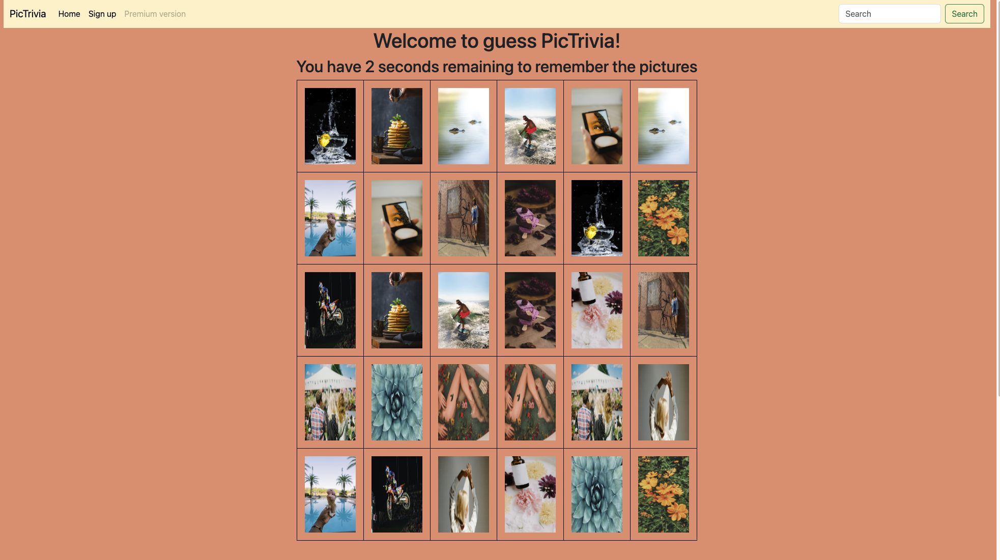

# PicTrivia

## Overview

**PicTrivia** is a simple game made with JavaScript. You have 10 seconds to look at a set of pictures, remember their positions, and then try to guess their positions correctly. This single-page application also includes a form. When users win the game, they can submit the form to claim their prizes.

## Features

- **Dynamic Timer**: The game starts with a countdown timer giving users 10 seconds to memorize the pictures.
- **Interactive Gameplay**: Users click on the hidden pictures to guess their positions.
- **Form Submission**: Winners can fill out a form to submit their details and claim their prizes.

## Technologies Used

- **HTML**
- **CSS**
- **Bootstrap**
- **Javascript**

## Technical Requirements Met

- **DOM Manipulation**: Elements are dynamically created and manipulated using DOM methods.
- **Event Handling**: Multiple event listeners are registered for game interactions and form submission.
- **Form Validation**: Both HTML attribute validation and JavaScript-based validation are implemented.
- **Browser Object Model (BOM)**: The application uses BOM methods like `window.location.reload()` and `alert()`.
- **Efficient DOM Updates**: `DocumentFragment` is used to optimize updates to the DOM.

## Installation

To set up the project locally, follow these steps:

1. **Clone the repository**:

   ```sh
   git clone https://github.com/zahrajoulaei/PicTrivia
   ```

2. **Navigate to the project directory**:

   ```sh
   cd PicTrivia
   ```

3. **Install Bootstrap and dependencies**:
   ```sh
   npm install bootstrap
   ```

## Sceenshots



## Contact

For any inquiries or feedback, please contact me at [zahrajoulaei@gmail.com](mailto:zahrajoulaei@gmail.com).Lovely pet is about all the pets make our lives more beautiful :)
